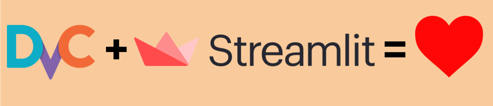

Dvc + Streamlit = ❤️
===



This repository is an example that illustrate how [dvc](https://dvc.org/)
together with [streamlit](https://streamlit.io/) can help tracking the model
performance during R&D exploration.

It contains scripts that:
1. download the [cat_vs_dogs dataset](https://www.tensorflow.org/datasets/catalog/cats_vs_dogs)
2. split the dataset into train/val/test subsets
3. train a classifier using transfer learning from a pre-trained network.
2. compute evaluation metrics

The python code is not the purpose of this repository.
It is adapted from [the transfer learning Tensorflow tutorial](https://www.tensorflow.org/tutorials/images/transfer_learning).

Data, metrics, model weights produced during the training and evaluation processed are tracked using [dvc](https://dvc.org/)
while a [streamlit app](https://streamlit.io/) allows to visually explore model predictions and compare trained models.

# Installation

### Requirements

- python > 3

Install dependencies with pip:
```
pip install -r requirements.txt
```
