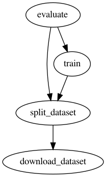

Dvc + Streamlit = ❤️
===


This repository is an example that demonstrates how [dvc](https://dvc.org/)
together with [streamlit](https://streamlit.io/) can help tracking the model
performance during R&D exploration.

The python code is not the purpose of this repository.
It is adapted from [the transfer learning Tensorflow tutorial](https://www.tensorflow.org/tutorials/images/transfer_learning).

Data, metrics, model weights produced during the training and evaluation processed
are tracked using [dvc](https://dvc.org/)
while a [streamlit app](https://streamlit.io/) allows to visually explore model
predictions and compare trained models.

## Installation

### Requirements

- python > 3
- For GPU support for Tensorflow 2.4.x: Nvidia drivers > 450 and Cuda >= 11

### Install dependencies

1. [Optional] Create and activate a virtual env with your favorite tool
   (e.g., virtualenv, conda, pyenv).
2. Install dependencies with pip: `pip install -r requirements.txt`

## DVC Commands

The repository contains [a single dvc pipeline](./dvc.yaml) that looks like this :



**Stages description**:

| # | Stage Name         | Description |
|---|--------------------|-------------|
| 1 | `download_dataset` | Download the [cat_vs_dogs dataset](https://www.tensorflow.org/datasets/catalog/cats_vs_dogs) to `data/raw` folder |
| 2 | `split_dataset`    | The cat vs dogs has no `test` subset. This stage keeps the `train` subset as is and splits the `val` subset into `val` and `test` subsets. Then, it copies images in `train` / `val` / `test` subfolders in `data/dataset` |
| 3 | `train`            | Train a classifier using transfer learning from a pre-trained network |
| 4 | `evaluate`         | Compute accuracy of the trained model on the `test` subset |

Useful dvc commands:

| Command     | Description |
|-------------|-------------|
| `dvc pull`  | Pull all the data: dataset images, model weights, etc |
| `dvc repro` | Relaunch the whole pipeline. Use `-f` to force pipeline execution or `-s` to launch a single stage. |
| `dvc plots show data/evaluation/predictions.csv --out data/evaluation/confusion.html` | Generate confusion matrix using the [dvc predefined template](.dvc/plots/confusion.json).|
| `dvc dag --full --dot \| dot -Tpng -o docs/images/dvc-pipeline.png` | Regenerate the pipeline graph above. The graphviz package is required. |

To go further, see the [dvc CLI reference](https://dvc.org/doc/command-reference).

> ⚠️ **A note on dvc remote storage**:
> remote storage is [the Sicara's public s3 bucket](s3://public-sicara/dvc-remotes/dvc-streamlit-example)
> (see [dvc config file](./.dvc/config)).
> By default, you have permission to read (`dvc pull`) but you cannot write (`dvc push`).
> If you want to run experiments and save your result with `dvc push`,
> consider adding [your own dvc remote](https://dvc.org/doc/command-reference/remote/add).


## Streamlit Dashboard

[TODO]


## Run with docker

1. Build the docker image: `docker build -t dvc-streamlit-example .`
2. Run the docker: `docker run --gpus all --rm -v $PWD:/tmp --shm-size=1g dvc-streamlit-example ${CMD}`.
   For instance, to relaunch the training pipeline:
   ```
   docker run --gpus all --rm -v $PWD:/tmp --shm-size=1g dvc-streamlit-example dvc repro
   ```
