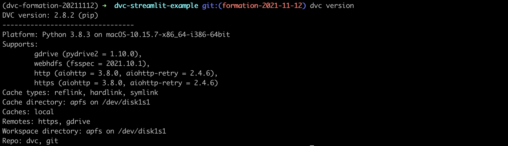

0 - Setup
===

### Python & Virtualenv

Use your favorite tool to create a virtualenv with Python 3.8.
E.g., with `pyenv`:

```bash
pyenv install 3.8.3  # Only once, not required if you already have python 3.8.3 installed
pyenv virtualenv 3.8.3 dvc-formation-20211112
pyenv activate dvc-formation-20211112
```

Then install python packages:

```bash
pip install -r requirements.txt
```

Check `dvc` is installed by running `dvc version` in your terminal. You should see:



---
Next: [:one: DVC Basics](./1_Basics.md)
