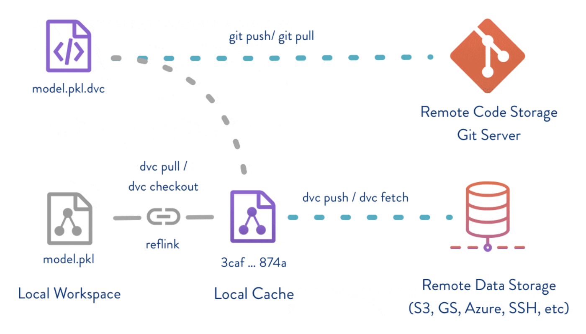
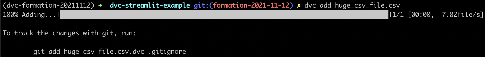
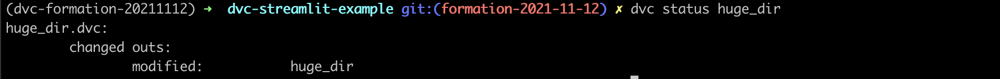

1 - DVC Basics
===

- :link: [What is DVC?](https://dvc.org/doc/user-guide/what-is-dvc)

# 1. DVC Core Feature is data versioning

> Data versioning is enabled by replacing large files, dataset directories, machine learning models, etc. with small metafiles (easy to handle with Git). These placeholders point to the original data, which is decoupled from source code management.



Let's try it:

```python
import pandas as pd
import numpy as np

N = int(1e6)

pd.DataFrame({"col_a": range(N), "col_b": np.random.random(N)}).to_csv(
    "huge_csv_file.csv"
)
```

File `huge_csv_file.csv` is about ~30MB. Let's add it with dvc:
```bash
dvc add huge_csv_file.csv
```


It creates two files:
1. `.gitignored` so that `huge_csv_file.csv` is not tracked with Git;
2. `huge_csv_file.csv.dvc`: dvc metafile containing a reference to the file -> this one should be tracked with Git (`git add`).

If you `cat huge_csv_file.csv.dvc`:
```yaml
outs:
- md5: 15c5bb5aecb5fb33e43291322514d1da  # Hash should be different
  size: 33047824
  path: huge_csv_file.csv
```

You can check the hash `md5sum huge_csv_file.csv` (or `md5` on MacOS).

# 2. The Local Cache Directory

What if we "lose" the CSV file? `rm huge_csv_file.csv`
- recover the file: `dvc checkout huge_csv_file.csv.dvc`


What's happening under the hood:
- :link: [Structure of the cache directory](https://dvc.org/doc/user-guide/project-structure/internal-files#structure-of-the-cache-directory)

"The DVC cache is a content-addressable storage": it means that even if files have different names with same content, it gets cached **only once**.

```bash
cp huge_csv_file.csv huge_csv_file_bis.csv
dvc add huge_csv_file_bis.csv
```

It works with directories!
```bash
mkdir huge_dir
mv huge_csv_file*.csv huge_dir
dvc add huge_dir
```

If you `cat huge_dir.dvc`:
```yaml
outs:
- md5: 20756b033f98bc1767c575a0e8e15417.dir  # Hash should be different
  size: 66095648
  nfiles: 2
  path: huge_dir
```

If you look at `20756b033f98bc1767c575a0e8e15417.dir` in the cache:
```json
[
  {
    "md5": "15c5bb5aecb5fb33e43291322514d1da",
    "relpath": "huge_csv_file.csv"
  },
  {
    "md5": "15c5bb5aecb5fb33e43291322514d1da",
    "relpath": "huge_csv_file_bis.csv"
  }
]
```

### The `.dvcignore` file

There are files you'll never want to be tracked e.g., `.DS_Store` files (MacOs).
```bash
touch huge_dir/.DS_Store  # Some file you do not want to track
dvc status huge_dir
```


The `.dvcignore` file is like `.gitignore`: just add `.DS_Store` in it does the trick.


# 3. The Remote Storage

- the [DVC config file](../.dvc/config)
- :link: [The config file](https://dvc.org/doc/command-reference/config)
- to update the local cache from remote storage: `dvc fetch`
- `dvc pull` = `dvc fetch` + `dvc checkout`
- to push to remote storage: `dvc push`

---
Next: [:two: Pipelines](./2_Pipelines.md)
