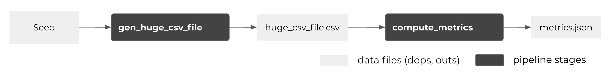
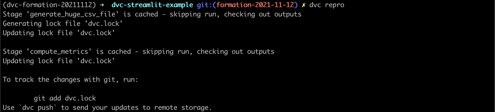

2 - Pipelines
===

- :link: [Data Pipelines](https://dvc.org/doc/start/data-pipelines)

# 1. A simple pipeline

Let's write a simple pipeline:


1. A script that generates `huge_csv_file.csv` - with a fixed seed for reproducibility
2. A script that compute metrics

### 1.1 Generate the CSV file

Create a `generate_huge_csv_file.py` script:

```python
import hashlib

import pandas as pd
import numpy as np

# 1. Inputs
YOUR_NAME = "antoinet"  # Should be unique in the audience
N_DATA = int(1e6)
HUGE_FILE_NAME = "huge_csv_file.csv"

# 2. Generate the file
seed = int(hashlib.md5(YOUR_NAME.encode()).hexdigest(), 16) % 2**32
np.random.seed(seed)
data_df = pd.DataFrame({"col_a": range(N_DATA), "col_b": np.random.random(N_DATA)})

# 3. Write result
data_df.to_csv(HUGE_FILE_NAME)
```

- try the script: `python generate_huge_csv_file.py`
- check the reproducibility: execute several times and `md5sum huge_csv_file.csv`
- `git add` / `git commit` the script

Now, let's execute the script with DVC !
- `dvc run --help`

```bash
dvc run \
--name generate_huge_csv_file \
--deps generate_huge_csv_file.py \
--outs huge_csv_file.csv \
python generate_huge_csv_file.py
```

It does:
- create `dvc.yaml`: description of the pipeline
- create `dvc.lock`: metafile for the deps and outs of the pipeline
- update `.gitignore`: add outs file to avoid them being tracked with git

Save the pipeline execution:
```
git add dvc.yaml dvc.lock .gitignore
git commit -m "Add my first pipeline"
```

### 1.2 Compute metrics

Create a `compute_metrics.py` script:

```python
import json
import pandas as pd

# 1. Inputs
HUGE_FILE_NAME = "huge_csv_file.csv"
METRICS_FILE_NAME = "metrics.json"

# 2. Open input files
data_df = pd.read_csv(HUGE_FILE_NAME)

# 3. Process the data
huge_metrics = 10e3 * (0.5 - data_df.col_b.mean())

# 4. Write result
with open(METRICS_FILE_NAME, "w") as metrics_file:
    json.dump({"metrics": huge_metrics}, metrics_file)
```

- try the script: `python compute_metrics.py`
- `git add` / `git commit` the script
- add the new stage to the DVC pipeline:
```bash
dvc run \
--name compute_metrics \
--deps compute_metrics.py \
--deps huge_csv_file.csv \
--outs metrics.json \
python compute_metrics.py
```
Save the new stage:
```
git add dvc.yaml dvc.lock .gitignore
git commit -m "Add compute_metrics stage to the pipeline"
```

### 1.3 Re-execute the pipeline

- reproduce the pipeline: `dvc repro`
- force reproduce the pipeline: `dvc repro --force`
- execute a stage: `dvc repro dvc.yaml:compute_metrics`
- execute a single stage: `dvc repro --single-item dvc.yaml:compute_metrics`


# 2. Improve the pipeline !

### 2.1 Factorize parameters

Create a `params.yaml` file:
```yaml
huge_file_name: huge_csv_file.csv
metrics_file_name: metrics.json
your_name: antoinet
n_data: 1000000
```

To inject it in the scripts, create a `params.py` file:
```python
import yaml

with open("params.yaml") as params_file:
    params = yaml.safe_load(params_file)

YOUR_NAME = params["your_name"]
N_DATA = params["n_data"]
HUGE_FILE_NAME = params["huge_file_name"]
METRICS_FILE_NAME = params["metrics_file_name"]
```

Then inject parameters in scripts:
- `generate_huge_csv_file.py`:
```python
import hashlib

import pandas as pd
import numpy as np

# 1. Inputs
from params import YOUR_NAME, N_DATA, HUGE_FILE_NAME

# 2. Generate the file
seed = int(hashlib.md5(YOUR_NAME.encode()).hexdigest(), 16) % 2**32
np.random.seed(seed)
data_df = pd.DataFrame({"col_a": range(N_DATA), "col_b": np.random.random(N_DATA)})

# 3. Write result
data_df.to_csv(HUGE_FILE_NAME)
```
- `compute_metrics.py`:
```python
import json
import pandas as pd

# 1. Inputs
from params import HUGE_FILE_NAME, METRICS_FILE_NAME

# 2. Open input files
data_df = pd.read_csv(HUGE_FILE_NAME)

# 3. Process the data
huge_metrics = 10e3 * (0.5 - data_df.col_b.mean())

# 4. Write result
with open(METRICS_FILE_NAME, "w") as metrics_file:
    json.dump({"metrics": huge_metrics}, metrics_file)
```

Then, we need to modify the `dvc.yaml` file:
- to declare params: add `params` key to the stages. When a parameter changes, it triggers the execution of the stage like a regular `deps`;
- to "parametrize" `outs` filenames: the single source of truth is the `params.yaml` file.

```yaml
stages:
  generate_huge_csv_file:
    cmd: python generate_huge_csv_file.py
    params:
    - huge_file_name
    - your_name
    - n_data
    deps:
    - generate_huge_csv_file.py
    outs:
    - ${huge_file_name}
  compute_metrics:
    cmd: python compute_metrics.py
    params:
    - huge_file_name
    - metrics_file_name
    deps:
    - compute_metrics.py
    - ${huge_file_name}
    outs:
    - ${metrics_file_name}
```

- save the changes
```bash
git add params.yaml params.py dvc.yaml *.py
git commit -m "Add parameters to the pipeline"
```
- run `dvc repro` then `git add` / `git commit`
- see parameter values: `dvc params diff`
- try to change parameters value and relaunch pipeline

### 2.2 Track metrics.json as DVC Metrics

- :link: [DVC metrics](https://dvc.org/doc/command-reference/metrics)

Modify the `compute_metrics` stage in `dvc.yaml`:
```yaml
stages:
  generate_huge_csv_file: (...)
  compute_metrics:
    cmd: python compute_metrics.py
    params:
    - huge_file_name
    - metrics_file_name
    deps:
    - compute_metrics.py
    - ${huge_file_name}
    metrics:
    - ${metrics_file_name}
```

- save the change: `git add` / `git commit`
- Show metrics: `dvc metrics show`
- Diff metrics: `dvc metrics diff`

# 3. DVC pipeline under the hood

- remove lock and output files: `rm dvc.lock huge_csv_file.csv metrics.json`
- repro the pipeline: `dvc repro`



- dvc "runs" are stored in `.dvc/cache/runs/`
- to avoid using cache: `dvc repro --no-run-cache`

---
Next: [:three: Experiments](./3_Experiments.md)
